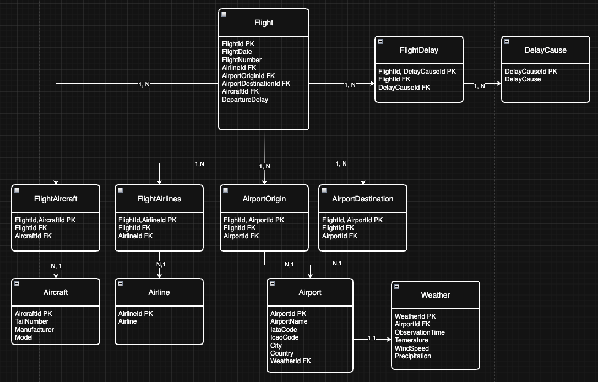

# FEB26-BDE-AIRLINES

## Start Up Guide API

1. Clone Repo
2. `docker compose up -d`
3. API is available: http://localhost:8000/docs

Start Up Guide old

1. Clone the GitHub Repo
2. Download flight data csv file: https://www.kaggle.com/api/v1/datasets/download/shubhamsingh42/flight-delay-dataset-2018-2024
3. Start the docker container
`docker compose up -d`
4. Initialize the database
`docker exec -i pg_airlines_container psql -U airlines -d airlines_db < ./flights_weather_medallion.sql`
5. run cleanup_kaggle_flight_data.ipynb
6. run get_weather_data.ipynb

## Database LDM

## Machine Learning v2
I did not test any of this code on a VM and I dont know if it can handle it. I am certain it wont be able to retrain the ML-model but a prediction might work. Like I mentioned I didnt test it.

1. Rewrote the model into a pipeline that connects to airlines:liora@localhost:5432/airlines_db. If you are working local with VS Code add port 5432 as a forwarded address. If no database is established yet use the guide with csv files.

Old Guide with csv files.

1. Rewrote the classification model into a pipeline to get rid of the bloat. I still used "kaggle_flights_clean.csv"and "weather_data.csv" to train the model. Files found here:
    - kaggle_flights_clean.csv: https://drive.google.com/file/d/1uvyeGw930CHKuyUHLrNF1h3jjwxu-erk/view?usp=drive_link
    - weather_data.csv: https://drive.google.com/file/d/1Csy6nV5IpnNEh5dNsntAxrEZgUAs2unQ/view?usp=drive_link

2. Requirements:
    - To run the notebook I installed the "Jupyter" extension in VS Code
        - like I mentioned before I did not try it with the VM provided by Liora

3. If you are using VS Code:
    - Clone the Github Repo.
    - Start VS Code and open the GitHub folder with VS Code.
    - open ml_class_pipeline.ipynb

### Retraining the model
1. The notebook and the .csv files have to be in the same folder.
2. Run Box_1 and it should load both .csv files and train a logistic regression model.
3. If you want to save the trained model run Box_2

### Making a prediction without retraining a model
1. To make a prediction you currently need 2 DataFrames with at least the following columns (more doesnt matter they should be ignored by the code):
    - df_flight:
        - flightdate
        - origin
        - origincityname
        - dest
        - destcityname
        - distance
        - distancegroup
        - diverted
    - df_weather:
        - weather_date
        - location_name
        - temp
        - temp_min_c
        - temp_max_c
        - relative_humidity
        - precipitation_mm
        - snow_mm
        - wind_speed_kmh
        - pressure_hpa
        - cloud_cover
2. Run Box_3 loads the model out of our .pkl file.
3. In Box_4 you have to edit the SELECT statement to fit your needs.
4. .predict() returns a numpy.ndarray so if you only predict on a single row the result is stored in pickle_predict[0]

## Work Documentation

Steps done until 17.03.26 by Timo

1. started documenting in README.md
2. git init
3. created docker compose yaml
4. created postgresql dump file

Steps done until 02.04.26 by Adam

1. explored and gain understanding of kaggle flight delay dataset
2. cleaned up and prepped csv before importing into db
3. prepared a clean notebook with clean up code
4. Researched how to get weather for time period and locations covered in flights dataset
5. fetched weather data and prepped for db insertion and documented process in a notebook
6. changed db schema to a medallion architecture (done on a new branch on git)
7. realized that exporting to csv and then importing to postgres db is not the right way; adjusted both notebooks to inject data directly to db
8. tested and populated db -- just the bronze layer

Steps done until 23.04.26 by Fabian

1. created two ML notebooks
2. prepared the classification notebook for better readability
3. added a way to save the trained model with pickle.
4. added regression model for completion BUT ITS NOT FINISHED!

Steps done until 28.04.26 by Timo

1. Set up FastAPI Docker Container in /api
2. Edited machine_learning_class.py to meet FastAPI requirements
3. Added requirements.txt to streamline installation
4. Updated README.md

Steps done until 28.04.26 by Fabian

1. Removed two ML notebooks
2. Reworked the classification model into a pipeline.
3. Added function to load data out of the db.
3. Updated requirements.txt.
4. Updated README.md to hopefully provide a clearer guide.

Steps done until 04.05.26 by Ali Doghan

1. Built Streamline Dashboard (Dash + Plotly, OOP architecture)
2. 5 pages: Overview, Airlines, Routes, Trends, Prediction
3. Professional dark theme with Navbar, Sidebar, Footer

